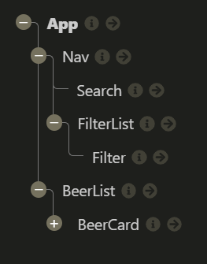

# Feedback

Right click on the file and click Open Preview or `ctrl/cmd + shift + v` to open preview

## Goals

1. Working beers web app - done
2. Practice using API and React - done
3. Application of what you're learning (React, Fetch etc.) - done

## Specification

### Start

> "All the wire frame content in black is the first part of the challenge - that is, the nav, the main section containing the beers and beer cards for each piece of data."



Your component tree looks great you have pretty much matched the wire frame & component tree from the brief. The only thing you are missing is a `<Main/>` component but it would only be useful if you had different pages. So it is okay to miss for now.

When you are building things in React have a go at breaking your project into a component tree before you go in with the code. It will help you out manage all of the moving pieces.

### Extension 1

> "Once you've got the design and layout sorted to render the elements, it's time to add some search functionality. Make it so you can search the beers by their name, and the page content should update as you type each letter in the box."

The aim of this extension is to get you using functions as props. You have smashed it, the function in your app is being passed multiple component levels to your search component. That component is using the function to capture the user input. This is all triggering your beers to be filtered by the search term.

### Extension 2

> Finally attempt to make it so you can filter the content on three conditions:
>
> > - High Alcohol (ABV value greater than 6%)
> > - Classic Range (Was first brewed before 2010)
> > - High Acidity (pH lower than 4)
> > - If you can’t achieve this after a good attempt, then feel free to move on to the final extension.

Nice going with this I can see you are updating your api URL with the correct params to get by abv and by classic range.

To manage the search you are filtering the response. You can actually do this in the request. You can add a search param to the endpoint `&beer_name=${searchInput}` this saves you filtering.

To manage acidity you have a boolean state on which you apply the filter.

```js
// 62 - 68 App.jsx
const lowPhBeers = beers.filter(beer => {
  if (filterPh) {
    return beer.ph < 4;
  } else {
    return beer;
  }
});
```

I think you could refactor the above as you end up filtering even if the `filterPh` is false. Why not set it so it only filters when `filterPh` is true. So you do not loop through the array unnecessarily.

### Extension 3

> Style the website however you see fit! Go wild!

It looks great, I can imagine this being a drinks ordering app for any pub / bar. Super clear and nicely branded.

I think you just need to tweak some of the mobile styles so it doesn't get squished.

## Overall

Very well componentised code across the board.

Good key for the BeerList map

Smart variable naming, code was easy to follow.

You have multiple functions being passed across your application. I feel confident with your understanding of useState, useEffect and funcs as props. Awesome mate good going!

Code cleanliness, structure, indentation, line length. This stuff is hard but technically with React I can see that you're where you need to be right now.

To make looking at your code easier I was formatting every file. It's tough to do manually but we can make our lives easier by using a auto-formatter like prettier.

You can edit how it formats files in your settings in VSCode, but it will clear up a good amount of cleanliness issues.

Just install it as an extension on VSCode, right-click a file, select "Format Document With..." and at the top of VSCode select "Prettier - Code Formatter".

## To work on

App is a little messy but you can easily tidy it up.

- State as a object?? :S
- Remove all of the `console.log()`
- You can remove the apiAddress state. It doesn't need to be state as it is never updated. You can just move it to your `useEffect()`
  ```jsx
  // 53 - 60 App.jsx
  const apiAddress = "https://api.punkapi.com/v2/beers?per_page=80";
  fetch(`${apiAddress}${filterAbv}${filterClassic}`)
    .then(response => response.json())
    .then(data => {
      setBeers(data.map(beer => beer));
    });
  ```

I think if you address the above, and refactor the filter and append the search term to the request. You will have a really solid project.

Final notes, when you run a react app, your terminal shows you warnings. These are generally easily googleable and simple to fix and will improve code quality. So always keep one eye on your terminal while coding in react.
